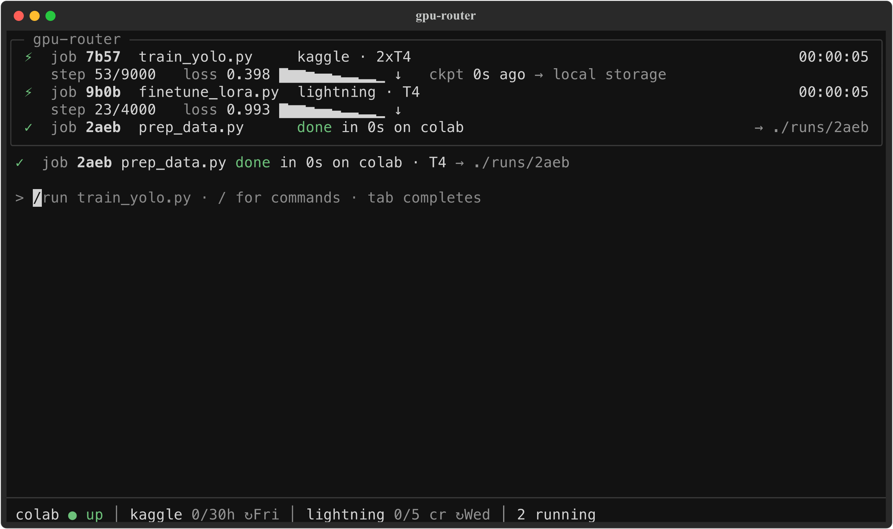
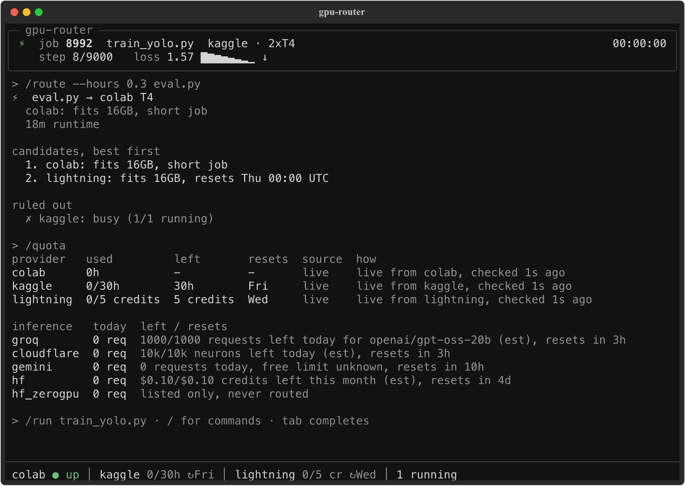

# gpu-router

**Run your training scripts on free cloud GPUs with one command, and let your coding agents do the same without spending your quota blind.**

`gpu run train.py` packages your project, picks the best free GPU you can reach right now (Kaggle, Google Colab, Lightning AI, or your Mac's MPS for smoke tests), streams the logs and drops the outputs in `./runs/<id>/`.

The free GPU hours already exist. The problem is that they're spread across providers that each have their own CLI, login, quota and session cap, which means an agent that wants a GPU either can't get one or burns your hours with nobody keeping count. gpu-router is the thing that keeps count: a local daemon that routes every job, explains why it picked what it picked, and asks you before an agent spends real time.

Free tiers only: no credit card, one account per provider. macOS on Apple Silicon for now.



In Claude Code (after `gpu statusline install`), a session's jobs show up as extra rows under your existing status line, only in that session and only while they're active. A job running on Kaggle, one waiting for your approval, and one that moved clouds mid-run:

```
gpu ████░░░░░░ 38% 1:50 left  kaggle ████████░░ 73% ↻Sat 5pm
train_yolo · 2×T4             loss 0.412 ↓  ckpt 3m ago

gpu ⏸ eval.py → colab T4      ~20m  /gpu-approve

gpu ↪ train_yolo              colab → kaggle  resumed · ckpt 4
gpu █████░░░░░ 42% 1:30 left  kaggle ████████░░ 73% ↻Sat 5pm
```

## What's in it

- **One CLI, four backends.** Kaggle (P100 or 2xT4), Colab (T4), Lightning AI (T4) and your Mac. The scripting commands also speak `--json` for scripts and agents.
- **A router that explains itself.** It drops providers that can't fit the job, scores the rest and stores a one-line reason for every decision. `gpu route` shows you the call before anything runs.
- **A quota ledger.** Live numbers where a provider exposes them (Kaggle, Lightning), estimates from your own job history where it doesn't, always labeled which.
- **Approval rules for agent jobs.** Short agent jobs run on their own. Long ones, ones with no runtime estimate and ones that read secrets wait for you, and there's no MCP tool that approves.
- **Crash-safe job state.** Every transition commits to SQLite with its event row. Kill the daemon mid-run and nothing is lost: remote runs keep going and the daemon reattaches on restart. Rate limits and outages reroute a job instead of failing it.
- **Your code, packaged.** Git-tracked files (plus untracked ones git doesn't ignore) ship on every run, dependencies come from `requirements.txt` or `pyproject.toml`, and `.env` files, keys and credential files never ship, even when tracked.
- **Checkpoint handoff (opt-in).** A job that saves to `gpu.checkpoint_dir()` can pick up on another provider when a session or quota runs out.
- **Claude Code and Codex.** An MCP server, a skill, slash commands and the status line rows above.
- **An inference lane.** `gpu infer` sends LLM calls and eval batches to free APIs (Groq, Cloudflare Workers AI, Gemini, Hugging Face), routed by model and quota left.
- **macOS notifications** when a job finishes, fails, needs approval or moves providers.

One daemon owns all of the state; the CLI, the shell, the MCP server and the status line are thin clients over it, so they always agree.

## Quickstart

You need macOS on Apple Silicon and [uv](https://docs.astral.sh/uv/) (it brings Python 3.12).

```bash
git clone https://github.com/ayushg8/gpu-router
cd gpu-router
uv tool install --editable .   # puts `gpu` on your PATH
gpu setup                      # provider CLIs, logins, launchd, Claude Code, a GPU test
```

`gpu setup` installs the provider CLIs it's missing with `uv tool install`, walks you through each login (tokens go to the macOS Keychain; Colab keeps using gcloud's own credentials), registers the daemon with launchd, offers the Claude Code and Codex integrations (it shows every change and defaults to no), then runs `gpu doctor` and a 10-second GPU test on each ready provider. Re-running it skips whatever is already done.

Then:

```bash
gpu route --hours 0.3 train.py   # where would it go, and why (nothing runs)
gpu run --smoke train.py         # quick check on this Mac first
gpu run train.py                 # the best free GPU, logs streamed, outputs in ./runs/<id>/
gpu status                       # what's running, where, and quota left
gpu                              # the interactive shell
```

What that looks like (real output, trimmed):

```
$ gpu route --hours 0.3 train.py
⚡ train.py → colab T4
  colab: fits 16GB, short job
  18m runtime

candidates, best first
  1. colab: fits 16GB, short job
  2. lightning: fits 16GB, resets Thu 00:00 UTC
  3. kaggle: fits 16GB (2xT4), saved for jobs over 4h

ruled out
  ✗ local: kept for smoke tests (use --smoke or --provider local)

$ gpu run --smoke train.py
⏸ submitted job 2510  train.py
  ⏸ placed on local MPS (local: MPS 16GB on this Mac, smoke test); submitting
  ⚡ running on local MPS
  ...
✓ train done in 5s on local · MPS  → ./runs/2510

$ gpu route --vram 24 train.py
✗ train.py cannot run anywhere
  no provider fits: needs 24GB VRAM and no free provider has more than 16GB (largest: colab); `gpu providers` lists the excluded ones
```

Per-project defaults go in a `gpu.yaml` at the project root (script, args, hours, VRAM, data, secrets), and flags override it. [docs/cli.md](docs/cli.md) has every command, flag, exit code and `--json` shape.

Only want the CLI and the MCP server? `uv tool install git+https://github.com/ayushg8/gpu-router` works too, but `gpu setup` installs the Claude Code plugin only from an editable checkout, so that one step becomes manual.

### The shell

Typing `gpu` opens a live job panel, a prompt and a quota footer. `/` opens the command list and tab completes commands, job ids and scripts: `/run`, `/route`, `/jobs`, `/logs`, `/watch` (live loss chart), `/cancel`, `/fetch`, `/approve`, `/deny`, `/quota`, `/history`, `/providers`, `/infer`, `/login`, `/doctor`, `/policy`, `/config`.



## Providers

| Provider | GPU (VRAM) | Free limit | Session cap | Resets |
|---|---|---|---|---|
| Kaggle | P100 or 2xT4 (16GB) | 30 GPU hours a week | 12h | Saturday 00:00 UTC |
| Google Colab | T4 (16GB) | Dynamic, unpublished | Up to 12h, not guaranteed | Unknown |
| Lightning AI | T4 (16GB) | 5 credits at signup; 15 a month after phone verification (reported, not yet confirmed). A T4 hour costs about 0.68 credits | 4h per job (gpu-router's own cap) | Monthly |
| Your Mac | MPS (unified memory) | Unlimited | None | n/a |

Kaggle needs a phone-verified account for GPUs, Lightning needs one for free credits, and the Colab login runs `gcloud auth application-default login`, so you need the gcloud CLI for Colab.

Limits change, so they live in [`providers.yaml`](src/gpu_router/providers/providers.yaml) as data instead of prose. `gpu doctor` compares the live limits against it and flags drift, and `gpu doctor --update-catalog` writes the fix into your own override file.

Not routed, on purpose: **Modal** (it needs a payment method on file, and it was the only free option above 16GB), RunPod, Lambda, Vast.ai and Beam (paid), and the Oracle, Azure and GCP trials (card required). Paperspace Gradient and Saturn Cloud are listed as verify-at-signup, and SageMaker Studio Lab is listed with a link since it has no API. `gpu providers` shows all of it with the reason.

## How routing works

1. **Filter.** Drop every provider that can't run the job: VRAM, GPU type, session cap, quota left, login, capacity.
2. **Score.** Spend the quota that resets soonest first. Save Kaggle for jobs over 4 hours and send short or interactive work to Colab. Keep your Mac for smoke tests. Penalize a job that would eat more than half of what a provider has left.
3. **Explain.** Every candidate gets a one-line reason, stored with the job and shown in `gpu route`, `gpu status <id>` and the shell.
4. **Fall back.** If provisioning fails or a provider rate-limits, it cools down and the job moves to the next candidate with backoff.

## Approval rules

Defaults, editable with `gpu policy set` (for example `gpu policy set agent.auto_max_hours 2`):

| Job | Agent jobs (MCP, or `gpu run` inside Claude Code / Codex) | Your jobs (`gpu run`, the shell) |
|---|---|---|
| 1 GPU-hour or less | Runs | Runs |
| Over 1 GPU-hour, or no runtime given | Asks | Runs (you typed it) |
| Reads Keychain secrets | Asks | Runs |
| Would use over 50% of a provider's remaining quota | Asks | Asks |
| Runs well past its declared hours (1.5x, at least 15 min over) | Checkpoints and waits for you | Keeps running |
| On your Mac | Runs | Runs |

You answer with `gpu approve <id>`, `/approve` in the shell or `/gpu-approve` in Claude Code. There's deliberately no MCP tool for approving, `/gpu-approve` can only be typed by you, and the skill tells agents never to run `gpu approve` themselves.

## Checkpoints and metrics

`import gpu` is on the path of every gpu-router job, including smoke runs on your Mac:

```python
import gpu

gpu.total_steps(total)                          # real progress bars instead of elapsed time
start = 0
if gpu.resume_dir():                            # None on a fresh start
    state = torch.load(gpu.resume_dir() / "last.pt")
    model.load_state_dict(state["model"]); start = state["step"] + 1
for step in range(start, total):
    loss = train_step()
    gpu.log(step=step, loss=loss)               # gpu status, the shell chart, the status line
    if step % 500 == 0 or gpu.checkpoint_requested():
        with gpu.atomic_checkpoint("last.pt") as tmp:   # lands in gpu.checkpoint_dir()
            torch.save({"model": model.state_dict(), "step": step}, tmp)
torch.save(model.state_dict(), gpu.output_dir() / "model.pt")   # fetched to ./runs/<id>/
```

No helper? Printing `step 10/100 loss=0.41` or a tqdm bar works too, since gpu-router parses stdout as a fallback.

Checkpoints sync every 20 minutes by default. About 30 minutes before a session cap, or before a provider's free hours run out, gpu-router flips `gpu.checkpoint_requested()`, waits for a fresh save and resumes the job somewhere else. Moving between clouds goes through a private Hugging Face Storage Bucket, so it's opt-in: run `gpu login hf` and `gpu login hf --remote` (a separate least-privilege token, the only one remote runtimes ever see). Without them, jobs still run and outputs still come back, but they can't continue on a different cloud, and a job with datasets under `data:` stays on your Mac. Status: the local path (kill a run, resume from its checkpoint) is tested end to end, while the HF bucket path has unit tests and an opt-in live test but hasn't had a full live cross-cloud run yet.

## Agents

### Claude Code

From your checkout, with `gpu` on your PATH (or let `gpu setup` do it):

```bash
claude plugin marketplace add "$PWD/plugin"
claude plugin install gpu-router@gpu-router-local
gpu statusline install   # optional: shows the settings.json diff and asks first; undo with gpu statusline uninstall
```

MCP only, no plugin: `claude mcp add gpu-router -- gpu mcp`.

- **MCP tools:** `gpu_submit`, `gpu_status`, `gpu_logs`, `gpu_fetch`, `gpu_cancel`, `gpu_quota`, `gpu_route`, and `gpu_infer` for LLM calls.
- **The gpu-router skill:** when to use a GPU instead of your laptop, how to write a script that survives a 12-hour session cap, how to follow a job, and never to call `kaggle`, `colab` or `lightning` directly.
- **Slash commands:** `/gpu-run`, `/gpu-status`, `/gpu-approve`, `/gpu-statusline`.
- **Status line rows:** at most two, only while that session has GPU work, nothing when idle. They read a cached state file (never the daemon or a provider) in about 21 ms median.

Every job result tells the agent what to do next: wait on jobs of about 15 minutes or less, report the id and stop on longer ones, and end its turn while you decide on an approval. Retrying a submit returns the same job instead of starting a second copy.

### Codex

Same MCP server. Add it to `~/.codex/config.toml` (Codex stops tool calls after 60 s by default, and a big submit or fetch can take longer):

```toml
[mcp_servers.gpu-router]
command = "gpu"
args = ["mcp"]
startup_timeout_sec = 30
tool_timeout_sec = 330
```

Then paste the marked section of [docs/codex/AGENTS-section.md](docs/codex/AGENTS-section.md) into your `AGENTS.md`. Codex has no `/gpu-approve`, so it relays the reason and you run `gpu approve <id>` in a terminal.

## Inference lane

```bash
gpu login groq                                          # stored in the Keychain after one free check call
gpu infer -m gpt-oss-20b "Summarize this stack trace"   # routed by model and quota left
gpu infer -m gpt-oss-20b -f evals.jsonl -o results.jsonl
```

| Provider | Free limit | Resets |
|---|---|---|
| Groq | 1,000 requests and 200k tokens a day, per model | 00:00 UTC |
| Cloudflare Workers AI | 10,000 neurons a day | 00:00 UTC |
| Google AI Studio (Gemini) | Per model, shown in AI Studio; free-tier prompts may be used to improve Google's products | Midnight Pacific |
| Hugging Face Inference Providers | $0.10 of credits a month | Monthly |

Groq and Gemini have been verified live; Cloudflare and Hugging Face are wired up but haven't been run against a real key yet.

## Safety and ToS

- **Free tiers only.** A provider that asks for a card is dropped, which is why Modal is out.
- **One account per provider.** gpu-router never creates, rotates or farms accounts. Kaggle's and Lightning's terms both say one account per person, and multi-accounting is how accounts get banned.
- **Agents go through the daemon, not provider CLIs.** The skill and the Codex section tell them never to call `kaggle`, `colab` or `lightning` directly, so the quota ledger stays correct.
- **Colab is batch jobs only,** through Google's official CLI: no `colab ssh`, no console, no hosted servers or web UIs on the free tier.
- **Secrets live in the macOS Keychain** and reach a job only at run time (on Kaggle, through a private dataset in your own account). They never go in config, SQLite, logs or job bundles, and a job's env rejects secret-looking names.
- **The daemon listens on 127.0.0.1 only,** requires a bearer token and rejects browser origins.
- **Nothing edits** `~/.claude/settings.json`, `~/.codex/config.toml` or launchd without showing you the change and asking first, unless you pass `--yes` yourself (an agent's `--yes` never counts for those).

## Limits

- **16GB is the ceiling.** Every free GPU left is a 16GB T4 or P100. A job that needs more is told so at routing (`gpu route` exits 12) instead of failing somewhere remote.
- **Lightning's free tier is T4 only.** A free account's L4 job came back 403 while T4 worked, so the catalog doesn't offer L4. If your plan runs it, add it back in your own `providers.yaml`.
- **Colab is best effort.** Google doesn't publish free limits, and a GPU isn't guaranteed.
- **Cross-cloud handoff is opt-in** and needs the Hugging Face tokens above; so do datasets on a cloud GPU.
- **macOS on Apple Silicon only** for now (launchd, the Keychain, MPS). Linux and Windows aren't supported yet.

## Development

```bash
uv sync
uv run pytest            # 2,595 tests; real providers are skipped unless GPU_ROUTER_REAL_PROVIDERS opts in
uv run pytest -m crash   # crash-recovery harness: spawns a real daemon and SIGKILLs it mid-run
uv run ruff check src tests && uv run mypy
```

Adding a provider means an adapter with seven calls (`submit`, `status`, `logs`, `fetch`, `cancel`, `quota`, `healthcheck`), a `providers.yaml` entry and a pass through the shared adapter contract suite. Each provider's quirks, failure modes and exact commands live in `src/gpu_router/providers/<name>/NOTES.md`.

## License

MIT. See [LICENSE](LICENSE).
