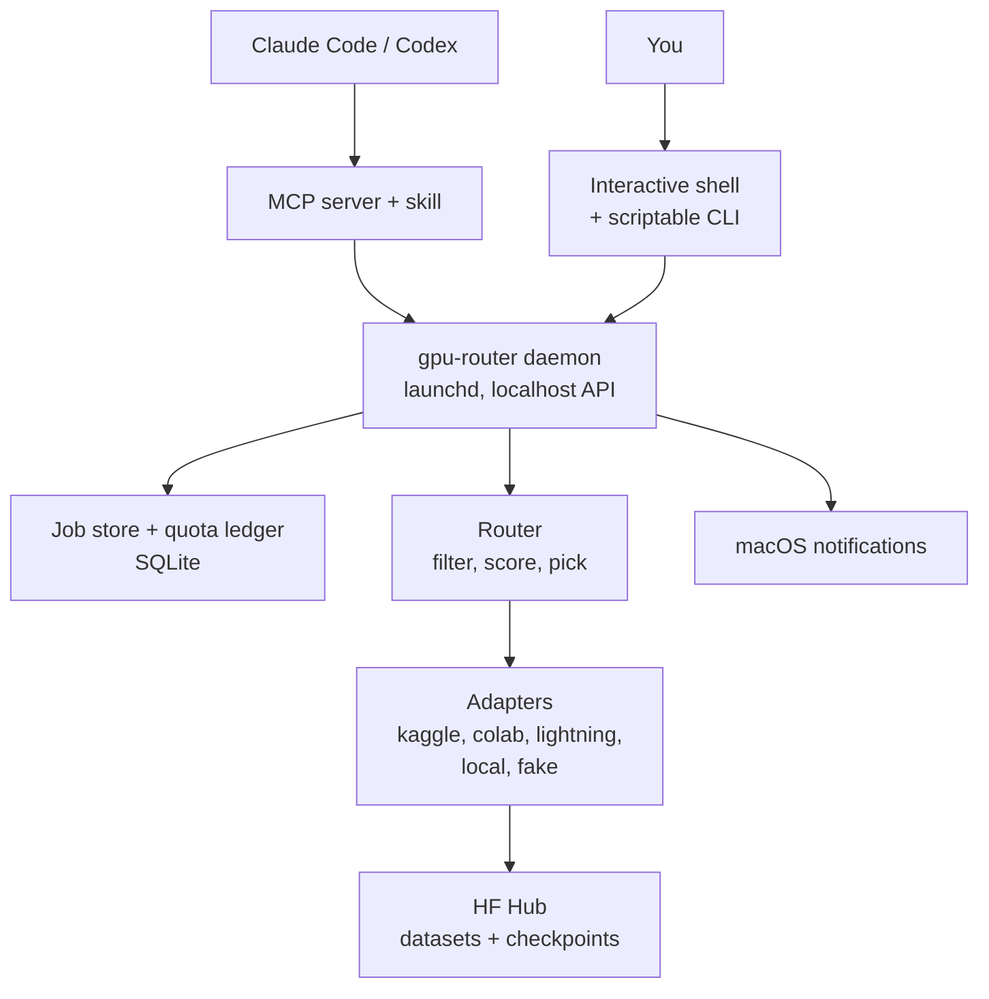
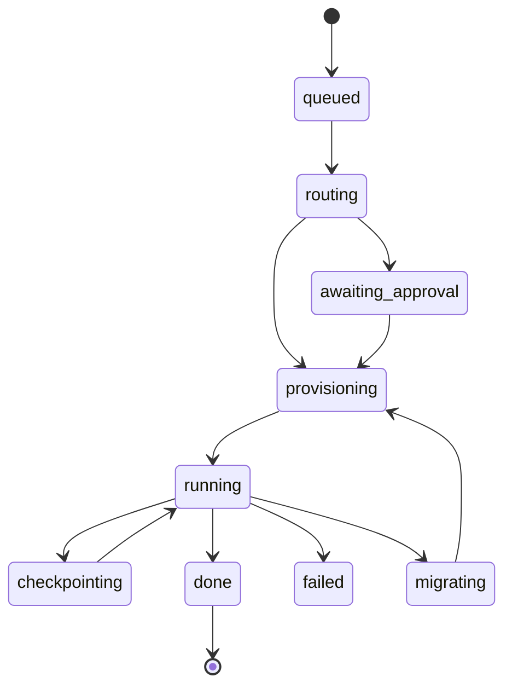

# gpu-router Build Spec

Sep 23, 2026

gpu-router gives your Claude Code and Codex sessions free GPU compute by routing jobs across free-tier cloud providers (~150–200 GPU hrs/month stacked). This is the handoff spec for Claude Code: read it fully, then build in the phase order in Build phases. Working command name is `gpu`; target is macOS on Apple Silicon.

## Decisions (answers to open questions)

| # | Question | Decision (2026-09-23) |
|---|----------|-----------------------|
| 1 | Final name | **gpu-router**, command **`gpu`** |
| 2 | Job spec | **Both**: per-project `gpu.yaml` plus flags; flags override the file |
| 3 | Metrics | **Both**: `gpu.log()` / `gpu.total_steps()` helper plus stdout parsing fallback |
| 4 | Status line | **Add rows** (max 2) only while GPU work is active; never replace existing rows |
| 5 | Modal card | **Dropped** (decided 2026-09-24): modal.com/docs/guide/billing says "Note that you must have a payment method on file in order to use Modal." That breaks the no-card rule. Nothing routes to or offers Modal (CLAUDE.md D50); the lines that name it below are superseded |

## Goals

An agent (or you) says "run this on a GPU" and it just works, on the best free provider available.

- Stack free tiers and chain them, so long training survives 12-hr session limits.
- Claude Code-style CLI: interactive shell, slash commands, status line.
- Always visible: what's running, where, why, and how much quota is left.

## Hard constraints

- Free tiers only. No provider that needs a credit card. If signup asks for one, drop that provider.
- One account per provider. Never multi-account to farm quota (ToS ban risk).
- Agents never call provider CLIs directly. Everything goes through the router so the quota ledger stays correct.

Non-goals for now: paid providers, a web dashboard, Windows/Linux support.

## Providers

Four cloud providers plus your Mac form the core. Build adapters for these first.

| Provider | GPU | Free limit | Runs headless via | Best for | Notes |
|---|---|---|---|---|---|
| Kaggle | P100 or 2×T4 (16GB) | ~30 hr/week, 12-hr session | `kaggle kernels push` | Long batch training | Phone verification. Reuses an existing `~/.kaggle` setup. |
| Google Colab | T4 (16GB) | Dynamic, not guaranteed, ~12-hr session | Official Colab CLI (`colab new/exec/run/download/log/stop`) | Quick, interactive jobs | Installed with uv (`google-colab-cli`). Ships its own skill; use it inside the adapter only. |
| Lightning AI | T4 / L4 | ~15 credits/month (~20–35 T4 hrs) | lightning SDK | Overflow | Phone verification. |
| ~~Modal~~ | ~~T4 to H100~~ | ~~$30/month, 10 GPU concurrency~~ | ~~`modal run`~~ | ~~Short jobs on big GPUs~~ | **Dropped**: needs a card (Decisions row 5). |
| Local Mac (MPS) | Apple Silicon | Unlimited | local python | Smoke tests, debugging | Always available. |

Verify at signup, add later: Paperspace Gradient (free M4000/T4, 6-hr auto-shutdown; tier keeps shifting), Saturn Cloud (150 free hrs/month advertised; GPU unclear).

Inference-only lane (evals, LLM calls): Cloudflare Workers AI (10k neurons/day), HF ZeroGPU (~5 min/day), Groq, Google AI Studio.

Manual only (show in UI, no adapter): SageMaker Studio Lab. T4, 4 hr/day, no API.

Excluded:

| Service | Why |
|---|---|
| RunPod, Lambda, Vast.ai, Beam | Paid |
| Azure for Students | 3 vCPU cap, no GPU VMs |
| Oracle, Azure, GCP trials | Card required |
| Together AI | Free tier discontinued |

## Architecture

One daemon owns all state; every interface is a thin client over it, so the shell, status line and agents always agree.



| Piece | Choice | Why |
|---|---|---|
| Language | Python | Every provider SDK is Python |
| Daemon | FastAPI on localhost, run by launchd | Auto-starts; jobs survive closing the terminal |
| Database | SQLite, versioned migrations | Simple, local, upgrade-safe |
| Scriptable CLI | Typer | Clean flags, `--json` output |
| Interactive shell | Textual | Tables, charts, live logs in one language. Ink/TS only if asked for. |
| Agent interface | FastMCP | Works with Claude Code and Codex |
| Secrets | macOS Keychain | Never in config files or logs |

## Core components

Checkpoint-and-handoff is the key design choice: it turns 12-hr free sessions into multi-day training.

### Adapter contract

Every provider implements the same seven calls. Adding a provider = new adapter + a `providers.yaml` entry + passing the contract test suite.

| Call | Returns |
|---|---|
| `submit(job)` | remote id |
| `status(id)` | job state |
| `logs(id, follow)` | log stream |
| `fetch(id, dest)` | outputs on disk |
| `cancel(id)` | — |
| `quota()` | used, limit, resets_at, source (live or est) |
| `healthcheck()` | ok, or the reason not |

### Job lifecycle



Every transition is saved and logged, so a daemon crash never loses a job. Rate limits or outages trigger a reroute with backoff, not a failure.

### Quota ledger

- Tracks usage per provider with reset windows: Kaggle weekly, Lightning monthly, Colab unknown. (Modal dropped, Decisions row 5.)
- Uses live numbers where the provider exposes them, otherwise estimates from local job history. Always labels which.

### Router

1. Filter: drop providers whose VRAM, session length or remaining quota can't fit the job.
2. Score:
   - Spend quota that resets soonest first.
   - Save Kaggle for long jobs (over 4 hr); Colab for short or interactive.
   - ~~Save Modal for jobs needing more than 16GB VRAM.~~ Superseded (Modal dropped, Decisions row 5): a job that needs more VRAM than any free provider has is no_fit, and the router says so.
   - Local MPS for smoke tests.
3. Pick and explain: store a one-line reason per decision, e.g. "colab: fits 16GB, kaggle saved for jobs over 4h".
4. Fallback: if provisioning fails or no GPU is free, try the next candidate.

### Checkpoint and handoff

- Jobs save checkpoints to HF Hub every 20 min (configurable).
- If a session dies or quota runs out, the router resumes the job on another provider from the latest checkpoint.

### Code and data movement

This is the hardest UX problem; get it right.

- Code: package git-tracked files only, respecting .gitignore. Small, ships every run.
- Dependencies: auto-detect requirements.txt or pyproject.toml.
- Data: upload datasets to HF Hub once, cache by hash, reuse forever.
- Outputs: auto-fetched to `./runs/<job-id>/` in the project.

### Training metrics

Support both:

- Helper (preferred): `gpu.log(step=i, loss=l)` plus `gpu.total_steps(n)` for real progress bars.
- Fallback: parse stdout for `loss=`, `step`, tqdm. Zero code changes.

## Interactive shell

Typing `gpu` opens a Claude Code-style shell: live job panel on top, prompt, and a status footer.

```
$ gpu
╭─ gpu-router ─────────────────────────────────────────────╮
│ ▶ job a7f2  train_yolo.py   kaggle · 2×T4   01:42:10     │
│   loss 0.412 ▁▂▃▄▅▆▇ ↓   ckpt 3 min ago → HF Hub         │
│ ⏸ job c19e  eval.py        waiting for your approval     │
│   route → colab T4 (kaggle saved for long jobs)          │
╰────────────────────────────────────────────────────────╯
> /approve c19e
────────────────────────────────────────────────────────────
kaggle 22/30h ↻Sat │ colab ● up │ lightning 14/20h │ 1 running
```

### Slash commands

| Command | Does |
|---|---|
| `/run <script>` | Submit a job. Flags only for overrides: `--vram`, `--hours`, `--provider` |
| `/route <script>` | Dry run: where it would go and why |
| `/jobs` | Running and queued jobs |
| `/logs <id>` | Live log stream |
| `/watch <id>` | Live loss/metric chart |
| `/cancel <id>`, `/fetch <id>` | Kill a job, download outputs |
| `/approve <id>`, `/deny <id>` | Answer agent job requests |
| `/quota` | Quota per provider with reset countdowns |
| `/history` | Past jobs, failures, handoffs |
| `/providers`, `/login <p>` | Connect and log into services |
| `/doctor` | Check every CLI is installed and logged in; compare real limits to providers.yaml |
| `/policy` | Approval rules |
| `/config`, `/help` | Settings, help |

- `/` opens a command popup; tab-autocomplete for commands, job ids and scripts.
- Every slash command also works as a plain command for agents and scripts: `gpu run train.py --json`.

### UX principles

1. Zero setup. First run launches a wizard: detect installed CLIs, walk through logins, run a 10-second GPU test per provider, then show "4 providers ready, ~180 free hrs/month".
2. `gpu run train.py` just works. Deps, packaging, VRAM estimate and output fetching are automatic.
3. Every decision is explained in `/route` and the job detail view.
4. Nothing fails silently. Every failure says what happened and what the tool did next.
5. macOS notifications when a job finishes, fails or needs approval.
6. One visual language everywhere: green running, yellow waiting, red failed, dim idle. Icons ⚡ ⏸ ✓ ✗ ↪.
7. Helpful empty states. No jobs shows quota left plus an example `/run`, never a blank screen.

### Approval policy

Defaults, editable with `/policy`:

| Job | Default |
|---|---|
| Under 1 GPU-hr on Kaggle, Colab or Lightning | Runs automatically |
| Over 1 hr | Asks first |
| Would use over 50% of a provider's remaining quota | Always asks |

## Claude Code status line

GPU info appears in your existing Claude Code status line only while GPU work is active, and copies its style exactly.

The status line the rows were designed against (an existing user script; its third row is the user's own):

```
Opus 5.5 1M   medium            no project
session ██░░░░░░░ 20% ↻1pm      week █████░░░░ 43% ↻Tue 4pm
(the user's own third row)
```

| Element | Style |
|---|---|
| Layout | 2 aligned columns, one fact per slot |
| Labels | lowercase, dim gray |
| Bars | solid white █ fill, dotted ░ empty |
| Numbers | bold white % |
| Resets | dim ↻ + time |
| Color | almost none; blue only on the model name |

Before writing anything, read the user's status line script (`statusLine` in `~/.claude/settings.json`, e.g. `bash "$HOME/.claude/statusline.sh"`) and reuse its exact column width, bar glyphs and ANSI colors. Append via a wrapper; never replace the user's lines.

### GPU rows by state

Running (left mirrors session, right mirrors week, row 2 mirrors the user's row 3):

```
gpu     ███████░░░░░░  38%  ~1:50 left     kaggle ████████░░░  73% ↻Sat
train_yolo  2×T4                           loss 0.412 ↓  ckpt 3m ago
```

Needs approval:

```
gpu     ⏸ eval.py → colab T4 · ~20m        /gpu-approve
```

Just finished (visible 10 min):

```
gpu     ✓ train_yolo · 3h12m               → ./runs/a7f2
```

Migrated:

```
gpu     ↪ train_yolo  colab → kaggle        resumed · ckpt 4
```

Nothing active: print nothing.

### Rules

- `gpu status --line` returns in under 50ms by reading a cached state file. Never call provider APIs from it.
- Max 2 extra rows. Multiple jobs show the main one plus a count (+2 queued).
- Color only on state icons: ⏸ yellow, ✗ red, ✓ green.
- Progress bar uses real steps when the helper reports them; otherwise elapsed vs session cap, labeled (1:42 of 12h).

## Agent integration and docs

Agents get one skill and one MCP server; they should never need to know which provider runs their job.

### Claude Code plugin (one install)

- MCP server with `gpu_submit`, `gpu_status`, `gpu_logs`, `gpu_fetch`, `gpu_cancel`, `gpu_quota`, `gpu_route`.
- The gpu-router skill.
- Slash commands inside Claude Code: `/gpu-run`, `/gpu-status`, `/gpu-approve`.
- The status line wrapper.

Codex: same MCP server, plus an AGENTS.md section with the skill's content.

### Docs, in three layers

| Layer | Read by | Contains |
|---|---|---|
| `gpu-router/SKILL.md` | Claude, Codex | When to use GPU vs local, job spec, checkpoint rule, metrics helper, reading results. Says: never call kaggle, colab or lightning directly. Short. |
| `providers/<name>/NOTES.md` | Adapters, maintainers when debugging, Claude Code while building | Login steps, quirks, failure modes, exact commands, official doc links |
| `providers.yaml` | Router | GPU types, VRAM, session cap, quota, reset schedule, card_required, verified_at |

Limits change often, so they live in `providers.yaml` as data, not prose. `/doctor` checks real limits against it and flags drift. Colab's bundled skill is used only inside the Colab adapter.

## Setup and quality bar

One command sets everything up; a fake provider and contract tests keep it solid.

`gpu setup`:

1. Install CLIs with uv: google-colab-cli, kaggle, lightning-sdk, huggingface_hub. (Not modal: dropped, Decisions row 5.)
2. Walk through each login; store tokens in Keychain.
3. Register the launchd service for the daemon.
4. Install the Claude Code plugin and status line wrapper. Ask before touching settings.json.
5. Run `/doctor` and smoke tests.

Quality bar:

- Adapter contract test suite that every provider must pass.
- Fake provider for testing routing, failures and migration without spending quota.
- State machine tests, including crash recovery (kill the daemon mid-job, confirm it resumes).
- Versioned config and database migrations.
- Structured daemon logs.
- No secrets in the repo, config or logs.

## Build phases

Ship each phase working end to end before starting the next.

- [ ] 1. Daemon, SQLite, job state machine, fake provider, tests
- [ ] 2. Scriptable CLI: `gpu run / status / logs / cancel / fetch --json`
- [ ] 3. Kaggle and Colab adapters, plus local MPS
- [ ] 4. Interactive Textual shell, slash commands, footer status bar
- [ ] 5. Router, quota ledger, checkpoint handoff via HF Hub
- [ ] 6. MCP server, skill, Claude Code plugin, Claude Code status line
- [ ] 7. Lightning adapter (Modal dropped: needs a card), then the verify-later and inference lanes
- [ ] 8. Setup wizard polish, notifications, `/doctor`

## Open questions

Ask the author when you reach each one; suggested defaults in brackets.

1. Final name for the tool and command. → **gpu-router / gpu**
2. Job spec: flags only, or also a per-project gpu.yaml? [both; flags override the file] → **both**
3. Metrics: helper, stdout parsing, or both? [both] → **both**
4. Status line: add new rows, or reuse the existing script's row 3 slot? → **add rows**
5. Modal: confirm no card is needed at signup. → **dropped**: its billing doc requires a payment method (Decisions row 5)

## Sources

- Google Colab CLI announcement
- Colab CLI on GitHub
- Kaggle: efficient GPU usage
- Modal pricing
- Lightning AI pricing
- AIMultiple: free cloud GPUs
- Spheron: free GPU credit programs 2026
- Free cloud GPUs for students (no card)
- Microsoft Q&A: Azure for Students GPU quota
- Saturn Cloud: 150 free hours
- Beam pricing
